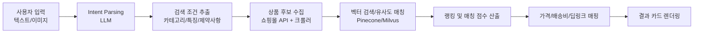

# PRD (Product Requirements Document) — FindIt AI

## 0. 문서 정보
| 항목 | 내용 |
|---|---|
| 제품명 | FindIt AI (가칭: "말만 하면 찾아주는 AI 커머스") |
| 버전 | v0.1 (초안) |
| 작성일 | 2026-09-05 |
| 상태 | Draft |

---

## 1. 개요 (Overview)

### 1.1 제품 한 줄 정의
사용자가 애매하고 구체적이지 않은 자연어로 원하는 상품을 설명하면, AI가 맥락을 해석하여 가장 일치하는 상품과 최저가 구매처를 즉시 연결해주는 AI 커머스 검색 서비스.

### 1.2 핵심 가치 제안 (Value Proposition)
- **설명이 부족해도 OK**: 정확한 상품명이나 브랜드를 몰라도 특징, 용도, 제약사항만으로 검색 가능.
- **맥락 이해**: 단순 키워드 매칭이 아닌 의도(Intent) 기반 검색.
- **원스톱 비교**: 여러 쇼핑몰의 가격/배송비를 한 번에 비교 후 최저가 구매처로 즉시 이동.

### 1.3 배경 및 문제 정의
- 기존 쇼핑몰 검색은 키워드 기반이라, 사용자가 정확한 상품명·스펙을 모르면 검색 결과가 부정확함.
- 사용자는 "여름에 입기 좋고 목 안 늘어나는 하얀색 오버핏 반팔티"처럼 자연스럽게 설명하고 싶어하지만, 이를 지원하는 서비스가 부족함.
- 여러 쇼핑몰(네이버, 쿠팡, 11번가, 29CM 등)을 일일이 비교하는 것은 번거로움.

---

## 2. 목표 및 성공 지표 (Goals & KPIs)

### 2.1 비즈니스 목표
- 자연어 검색 기반 신규 커머스 검색 트래픽 확보
- 제휴 마케팅을 통한 구매 전환 수익 창출
- 장기적으로 B2B API 판매 채널 확보

### 2.2 핵심 성공 지표 (KPI)
| 지표 | 설명 | 목표(예시) |
|---|---|---|
| 검색→클릭 전환율 | 검색 결과에서 상품 카드 클릭 비율 | ≥ 35% |
| 클릭→구매 전환율 | 구매 사이트 이동 후 실제 구매 전환 | ≥ 3% |
| 매칭 정확도(체감) | 사용자가 원하는 상품이 상위 노출되는 비율 | ≥ 80% |
| 평균 응답 시간 | 검색 입력 후 결과 표시까지 | ≤ 3초 |
| 재사용률 | 7일 내 재검색 사용자 비율 | ≥ 25% |

---

## 3. 타겟 사용자 (Target Users)

- **주 타겟**: 온라인 쇼핑을 자주 하지만, 정확한 상품명·브랜드를 몰라 검색에 어려움을 겪는 20~40대 소비자.
- **니즈**: "정확히 뭐라고 검색해야 할지 모르겠는데, 이런 느낌의 제품을 찾고 싶다."
- **페르소나 예시**:
  - 페르소나 A: "여름 반팔티 살 때 목 늘어남이 항상 스트레스인 직장인"
  - 페르소나 B: "운동할 때 귀 안 아픈 이어폰 찾는 러너"

---

## 4. 핵심 기능 (Core Features)

### 4.1 맥락 파악형 자연어 검색 (Intent Parsing)
- **입력 예시**:
  - "여름에 입기 좋고 목 안 늘어나는 하얀색 오버핏 반팔티"
  - "이어폰인데 귀 안 아프고 골전도 방식인 거"
- **동작**: LLM이 사용자 입력을 아래 3요소로 분해
  1. 상품 카테고리
  2. 핵심 특징 (소재, 색상, 디자인, 스펙 등)
  3. 사용 목적 / 제약사항 (가격대, 용도, 착용감 등)
- 분해된 요소를 기반으로 다단계 검색을 수행.

### 4.2 3단계 맞춤 매칭 로직

| 단계 | 명칭 | 설명 |
|---|---|---|
| 1단계 | 의도 추출 (Intent Extraction) | LLM이 텍스트에서 가격대, 용도, 디자인 등 제약 조건 추출 |
| 2단계 | 상품 추천 및 비교 (Retrieval & Ranking) | 쇼핑몰 API(네이버 쇼핑, 쿠팡, 11번가, 29CM 등) + 웹 크롤러로 후보 수집, 가장 일치하는 대표 상품 3~5개 선별 |
| 3단계 | 가격 & 링크 실시간 연동 (Price Mapping) | 쇼핑몰별 판매가, 배송비, 최저가 구매 딥링크 자동 매핑 |

### 4.3 입력 대안 다변화
- **텍스트 설명**: 기본 대화형 입력 (자유 문장 입력)
- **이미지 + 설명**: 이미지 업로드 + 텍스트 보완 (예: "이 사진 의자랑 비슷한 느낌인데 10만 원대인 제품") — 시각적 검색(Visual Search) 연동

---

## 5. 화면 구성 및 UX

### 5.1 메인 화면
- 단순한 검색창 하나
- 검색창 하단에 예시 태그(칩) 노출 (예: "목 안늘어나는 반팔티", "골전도 이어폰")
- 이미지 업로드 버튼(카메라/앨범 아이콘)

### 5.2 결과 화면 (카드 형태)

| 영역 | 구성 요소 |
|---|---|
| 상품 카드 | 대표 이미지, 정품 상품명, 매칭 점수(예: "98% 일치") |
| 추천 이유 | AI가 사용자의 설명 중 반영한 부분 요약 (예: "목 늘어남 방지 봉제", "100% 면") |
| 가격 정보 | 최저가, 쇼핑몰별 가격 비교(쿠팡/네이버/29CM 등) |
| 바로가기 | [구매 사이트 바로가기] 버튼 → 해당 쇼핑몰 구매 페이지로 이동 |

### 5.3 상태별 UX
- 로딩 상태: "AI가 취향을 분석하고 있어요..." 등 진행 메시지
- 결과 없음: 검색어 재구성 제안 (예: 조건 완화 제안)
- 에러: 재검색/새로고침 유도

---

## 6. 수익 모델 (Business Model)

1. **제휴 마케팅 (Affiliate Marketing)**
   - 제공 링크를 통한 구매 발생 시 1~5% 수수료 (쿠팡 파트너스, 네이버 쇼핑 제휴 등)
2. **쇼핑몰 CPC/CPM 광고**
   - 브랜드/입점업체의 스폰서드 상품을 추천 알고리즘 상위 노출
3. **B2B API 연동 솔루션**
   - 대형 이커머스 검색창에 자연어 검색 엔진을 API 형태로 판매/구독

---

## 7. 핵심 기술 스택

| 영역 | 기술 |
|---|---|
| 자연어 처리 (LLM) | GPT-4o / Claude 3.5 Sonnet 기반 프롬프트 엔지니어링 및 튜닝 |
| 임베딩 & 벡터 DB | Pinecone, Milvus (상품 설명/리뷰 데이터 유사도 검색) |
| 데이터 수집/연동 | 네이버 쇼핑 Search API, 쿠팡 파트너스 API, Playwright/BeautifulSoup 기반 크롤러 |

---

## 8. 시스템 아키텍처 (개략)

---

## 9. 비기능 요구사항 (Non-functional Requirements)

- **성능**: 검색 결과 평균 응답 3초 이내
- **정확성**: 매칭 점수 산출 로직의 일관성 및 설명 가능성(추천 이유 명시)
- **확장성**: 신규 쇼핑몰 API 추가가 용이한 어댑터 구조
- **보안**: 쇼핑몰 API 키/제휴 토큰 등 민감정보는 서버 환경변수로 관리, 클라이언트 노출 금지
- **법적 고지**: 제휴 링크임을 명시(예: "이 링크는 제휴 마케팅 링크입니다")

---

## 10. 제약사항 및 리스크

| 리스크 | 설명 | 대응 방안 |
|---|---|---|
| 쇼핑몰 API 정책 변경 | API 제공사의 정책/요금 변경 리스크 | 크롤러 병행, 어댑터 구조로 대체 소스 확보 |
| LLM 응답 지연/비용 | LLM 호출 비용 및 응답 지연 | 캐싱, 배치 처리, 저비용 모델 폴백 |
| 매칭 정확도 | 애매한 입력에 대한 오매칭 가능성 | 사용자 피드백 루프, 재검색 유도 UX |
| 저작권/이미지 사용 | 상품 이미지 크롤링 관련 저작권 이슈 | 공식 API 이미지 우선 사용 |

---

## 11. 로드맵 (제안)

| 단계 | 범위 |
|---|---|
| MVP | 텍스트 검색 → 3단계 매칭 → 카드 결과 (샘플/제한된 쇼핑몰 연동) |
| v1.0 | 실 쇼핑몰 API 연동 확대, 이미지 검색 지원 |
| v1.5 | 벡터 DB 기반 유사도 검색 고도화, 추천 이유 정교화 |
| v2.0 | B2B API 상품화, 광고/스폰서드 상품 시스템 도입 |

---

## 12. Open Questions
- 초기 지원 쇼핑몰 우선순위(네이버/쿠팡/11번가/29CM 중 어디부터?)
- 이미지 검색 기능의 MVP 포함 여부
- 매칭 점수 산출 알고리즘의 구체적 정의(코사인 유사도 vs LLM 재평가 등)
